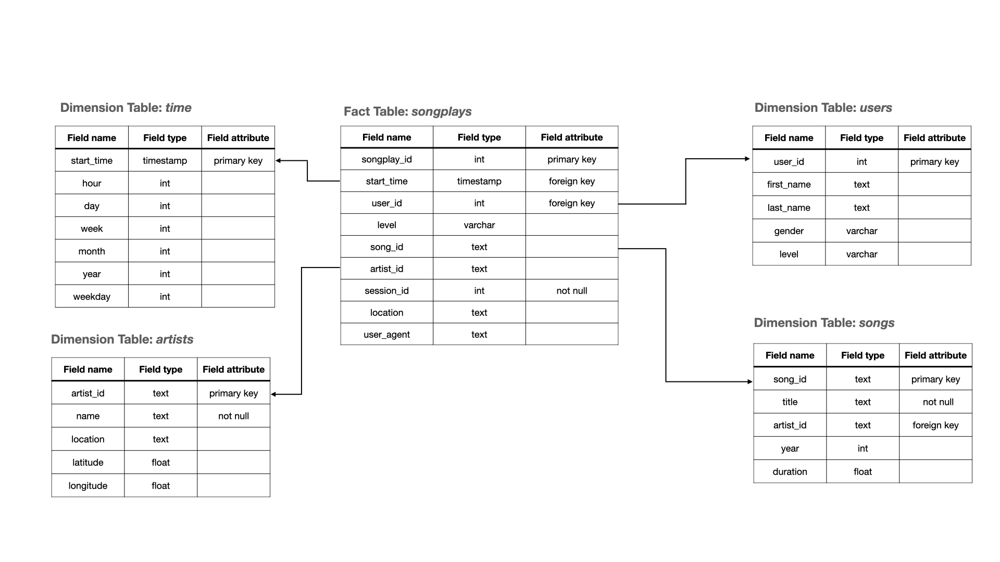

 [![Contributors][contributors-shield]][contributors-url] [![Stargazers][stars-shield]][stars-url] [![Forks][forks-shield]][forks-url] [![Issues][issues-shield]][issues-url] [![MIT License][license-shield]][license-url] [![LinkedIn][linkedin-shield]][linkedin-url]

<br />
<p align="center">
    <a href="https://github.com/najuzilu/DM-PostgreSQL">
        
    </a>
    <h3 align="center">Data Modeling with PostgreSQL</h3>
</p>


## About the Project

Sparkify wants to analyze the data they've been collecting on songs and user activity on their new music streaming app. The analytics team is particularly interested in understanding what songs users are listening to. Currently, they don't have an easy way to query their data, which resides in a directory of JSON logs on user activity on the app, as well as a directory with JSON metadata on the songs in their app.

They'd like a data engineer to create a Postgres database with tables designed to optimize queries on song play analysis, and bring you on the project. Your role is to create a database schema and ETL pipeline for this analysis. You'll be able to test your database and ETL pipeline by running queries given to you by the analytics team from Sparkify and compare your results with their expected results.

## Description

You will create a Postgre database which will host data collected on songs and user activity on Sparkify's new music streaming app. First you will start by creating the database schema during which process we will define _fact_ and _dimension_ tables for a _star schema_. Then, you will create ETL pipelines which will transfer data from files in local directories into the tables in Postgre using both Python and SQL. Finally, you will conclude by testing the database and ETL pipelines using provided tests from the analytics team.

### Tools

* python
* PostgreSQL
* Jupyter notebook

## Datasets

You will combine data from two local directories to create the _fact_ and _dimension_ tables.

The first dataset contains metadata about a song and the artist of that song which is saved in a JSON format. These files are partitioned by the first three letters of each song's track ID and are located under `./data/song_data/`. A single song file has the following information:

| Fields        | Description |
| :------------ | :---------- |
| num_songs |  number of songs by artist |
| artist_id |  artist id | 
| artist_latitude |  latitude coordinate if provided which depends on the artist's location | 
| artist_longitude |  longitude coordinate if provided which depends on the artist's location | 
| artist_location |  address or location of artist | 
| artist |  full name of artist | 
| song_id |  id used to identify song | 
| title |  title of song | 
| duration |  duration of song | 
| year |  year when song was published | 

The second dataset contains log files generated by an event simulator based on the songs in the first dataset. This event simulation, simulates activity logs from the Sparkify music streaming app. These log files are partitioned by year and month and are located under `./data/log_data/`. These files contain the following information:

| Fields        | Description |
| :------------ | :---------- |
| artist |  name of artist | 
| auth |  tracks whether the user logged in or logged out | 
| firstName |  user first name | 
| lastName |  user last name | 
| gender |  user gender | 
| length |  length of session/event | 
| itemInSession |  number of items for a specific session | 
| level |  tracks whether the user paid for the session or if the session was free | 
| location |  user location | 
| method |  HTTP methods | 
| page |  tracks page name such as 'NextSong', 'Home', 'Logout', 'Settings', 'Downgrade', 'Login', 'Help', 'Error', 'Upgrade' | 
| registration |  registration timestamp | 
| sessionId |  session id | 
| song |  song name | 
| status |  tracks the status of the request such as status 200, 307, 404 | 
| ts |  timestamp in millisecond | 
| userAgent |  operating system user agent | 
| userId |  user id | 

## ERD Model

You will use the _star database schema_ as data model for this ETL pipeline, which contains fact and dimension tables. An entity relationship diagram is shown below.



## Getting Started

Clone this repository

```bash
git clone https://github.com/najuzilu/DM-PostgreSQL.git
```

### Prerequisites

* conda
* python 3.8
* psycopg2
* pandas
* ipykernel

Create a virtual environment through Anaconda using

```bash
conda env create --file environment.yml
```

To install the IPython kernel, run

```bash
python -m ipykernel install --user --name dm-postgre-sql
```

## Project Steps

1. Run `create_tables.py` to create the tables
    ```bash
    python create_tables.py
    ```
2. Run `etl.py` to execute the ETL pipeline and load the data in PostgreSQL
    ```bash
    python etl.py
    ```
    Alternatively, you can open and run `etl.ipynb` for an easy-to-use, interactive environment.
3. Open and run `test.ipynb` to make sure the tables have been populated.

## Authors

Yuna Luzi - @najuzilu

## License

Distributed under the MIT License. See `LICENSE` for more information.

<!-- Links --->

[contributors-shield]: https://img.shields.io/github/contributors/najuzilu/DM-PostgreSQL.svg?style=flat-square
[contributors-url]: https://github.com/najuzilu/DM-PostgreSQL/graphs/contributors
[forks-shield]: https://img.shields.io/github/forks/najuzilu/DM-PostgreSQL.svg?style=flat-square
[forks-url]: https://github.com/najuzilu/DM-PostgreSQL/network/members
[stars-shield]: https://img.shields.io/github/stars/najuzilu/DM-PostgreSQL.svg?style=flat-square
[stars-url]: https://github.com/najuzilu/DM-PostgreSQL/stargazers
[issues-shield]: https://img.shields.io/github/issues/najuzilu/DM-PostgreSQL.svg?style=flat-square
[issues-url]: https://github.com/najuzilu/DM-PostgreSQL/issues
[license-shield]: https://img.shields.io/badge/License-MIT-yellow.svg
[license-url]: https://github.com/najuzilu/DM-PostgreSQL/blob/master/LICENSE
[linkedin-shield]: https://img.shields.io/badge/-LinkedIn-black.svg?style=flat-square&logo=linkedin&colorB=555
[linkedin-url]: https://www.linkedin.com/in/yuna-luzi/